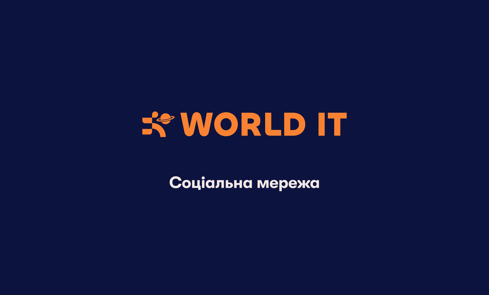
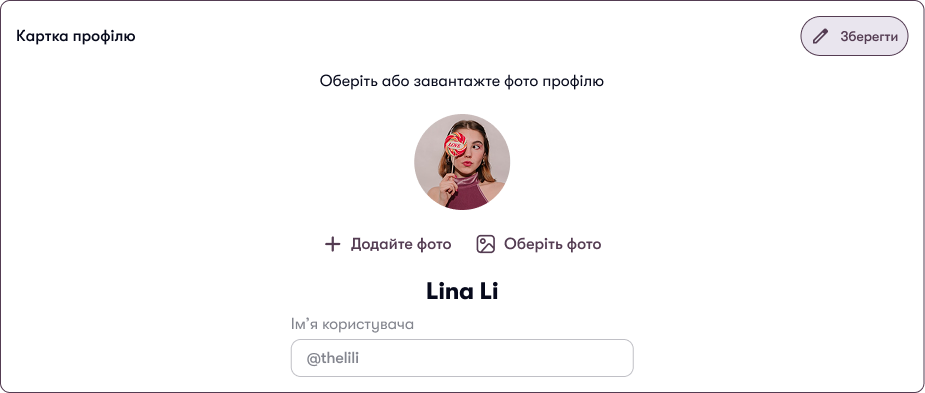
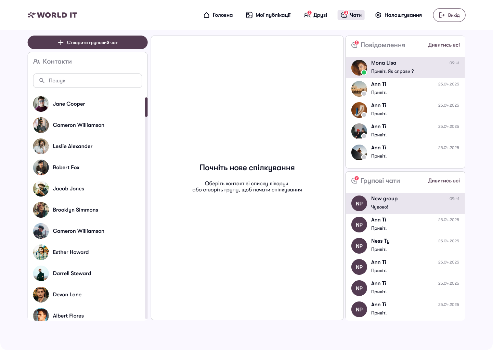
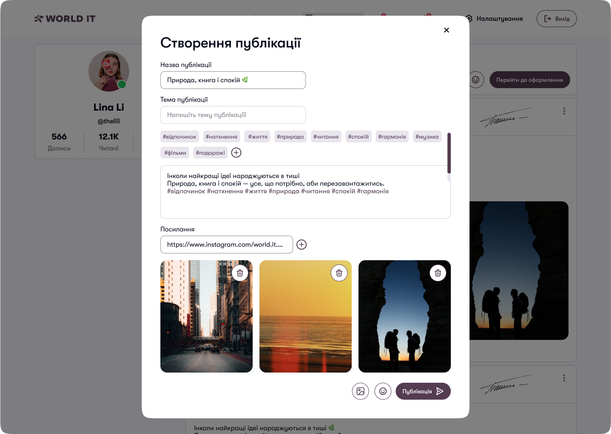
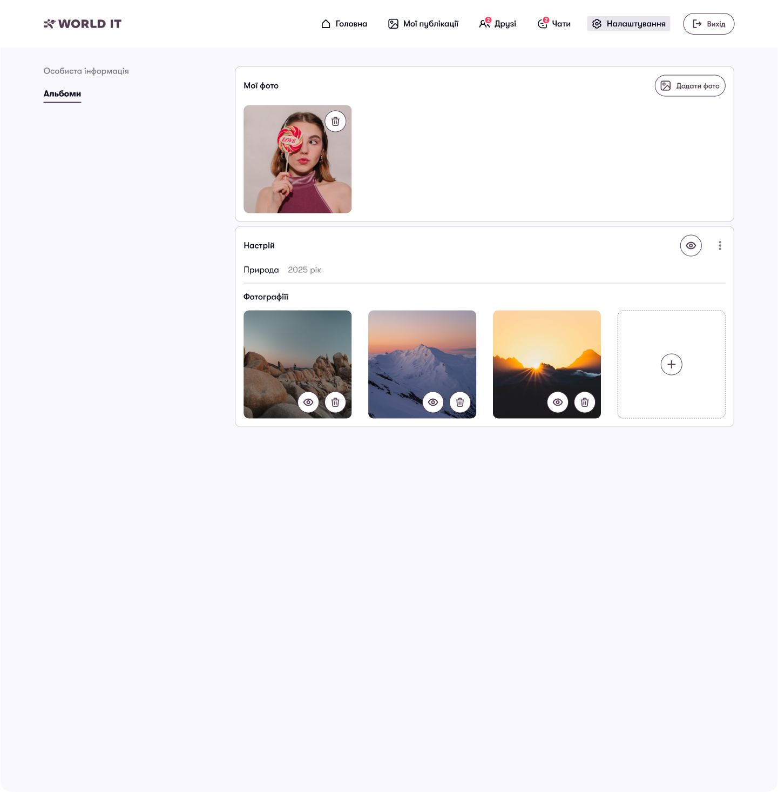
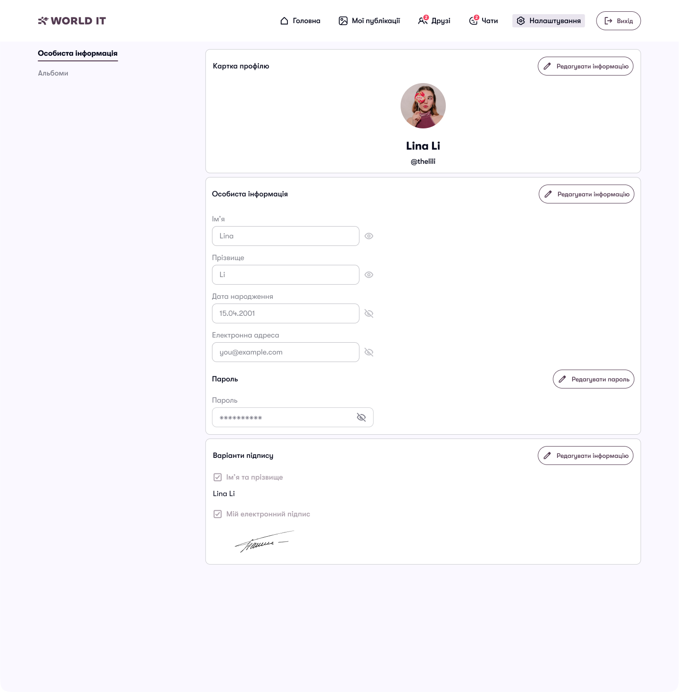
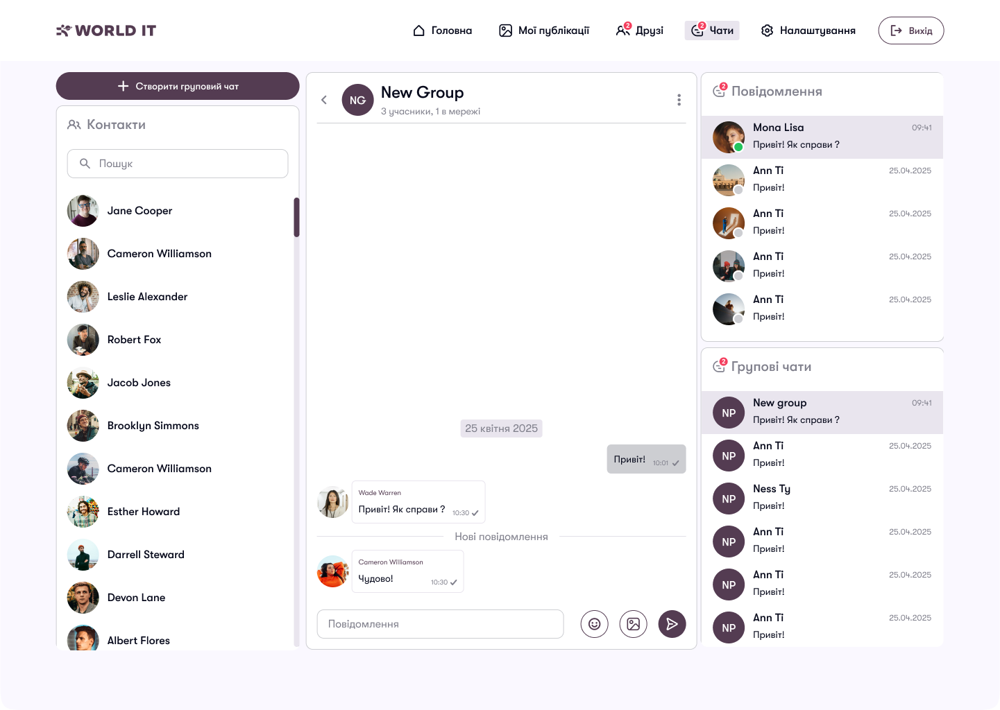
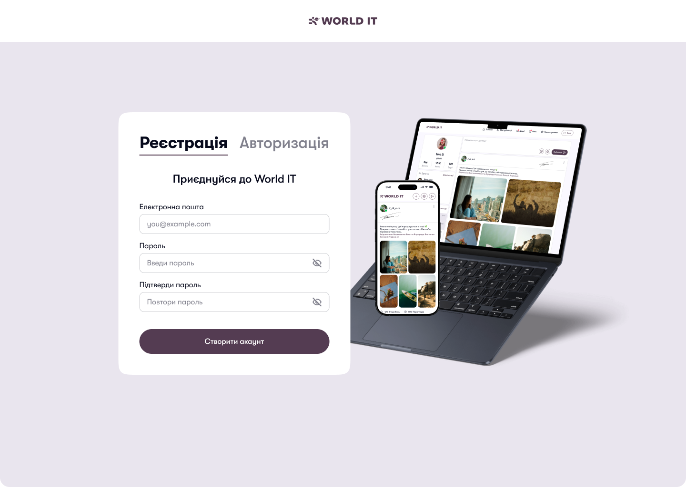
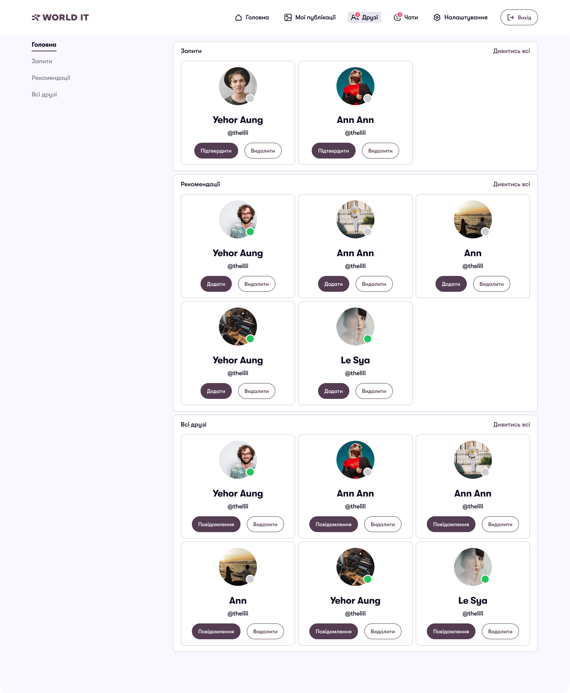

# 🌐 Соціальна мережа "World IT" <a id="top"></a>



## 📑 Зміст <a id="contents"></a>

- [Мета проєкту](#purpose)
- [Діаграма структури проєкту](#architecture-diagram)
- [Розгортання проєкту на локальному ПК](#local-setup)
- [Налаштування віртуального оточення](#virtual-env)
- [Запуск проєкту](#run-project)
- [Особливості розробки](#features)
  - [Робота з зображеннями](#images)
  - [Робота з WebSocket](#websocket)
  - [Принцип роботи постів](#posts)
  - [Принцип роботи альбомів](#albums)
  - [Принцип роботи налаштувань](#settings)
  - [Принцип роботи чатів](#chats)
  - [Робота з AJAX](#ajax)
  - [Принцип роботи реєстрації та авторизації](#auth)
  - [Принцип роботи системи друзів](#friends)
- [Висновок](#conclusion)

## 🎯 Мета проєкту <a id="purpose"></a>

**World IT Messenger** - це амбітна соціальна мережа, створена для об’єднання людей, які цікавляться технологіями, програмуванням та інноваціями. Наша мета - створити платформу, де користувачі можуть спілкуватися, ділитися ідеями через пости, створювати та підтримувати соціальні зв’язки через систему друзів, а також обмінюватися повідомленнями в реальному часі. Проєкт розроблено як модульний та масштабований, щоб забезпечити гнучкість для подальшого розвитку.

**Кому буде корисним:**
- **Розробникам та ентузіастам IT**: для обміну знаннями, портфоліо та ідеями через пости та чати.
- **Студентам**: для пошуку однодумців, навчання та створення спільних проєктів.
- **Ком’юніті-менеджерам**: для організації групових чатів та заходів.
- **Широкій аудиторії**: для соціалізації через персоналізовані профілі, пости та систему друзів.

Проєкт використовує сучасні технології, такі як Django, WebSocket (Django Channels), AJAX, та адаптивний дизайн, що робить його зручним для всіх типів пристроїв.

[Повернутися до змісту](#contents)

## 🏗️ Діаграма структури проєкту <a id="architecture-diagram"></a>

Нижче наведено діаграму структури проєкту, яка відображає основні модулі та їх взаємозв’язки:

```mermaid
graph TD
    subgraph Messenger-Project
        A("Messenger")
        B("Posts_app")
        C("Messenger_app")
        D("Registration_app")
    end

    subgraph Messenger
        A_static("static")
        A_templates("templates")
        A_init("__init__.py")
        A_asgi("asgi.py")
        A_settings("settings.py")
        A_urls("urls.py")
        A_wsgi("wsgi.py")

        A_static --> A_css("css")
        A_css --> A_base_css("base.css")
        A_static --> A_fonts("fonts")
        A_fonts --> A_demo_html("demo.html")

        A_templates --> A_templates_messenger("Messenger")
        A_templates_messenger --> A_base_html("base.html")
    end

    subgraph Posts_app
        B_static("static")
        B_templates("templates")
        B_init("__init__.py")
        B_admin("admin.py")
        B_apps("apps.py")
        B_forms("forms.py")
        B_models("models.py")
        B_tests("tests.py")
        B_views("views.py")

        B_static --> B_css("css")
        B_css --> B_pub_css("pub.css")
        B_static --> B_js("js")
        B_js --> B_pub_js("pub.js")

        B_templates --> B_posts_html("Posts.html")
    end

    subgraph Messenger_app
        C_static("static")
        C_templates("templates")
        C_init("__init__.py")
        C_admin("admin.py")
        C_apps("apps.py")
        C_forms("forms.py")
        C_models("models.py")
        C_routing("routing.py")
        C_tests("tests.py")
        C_views("views.py")

        C_static --> C_css("css")
        C_css --> C_auth_css("authorization.css")
        C_css --> C_chats_css("chats.css")
        C_css --> C_friends_css("friends.css")
        C_css --> C_messenger_css("Messenger.css")
        C_css --> C_personal_chat_css("personal_chat.css")
        C_css --> C_profile_css("profile.css")
        C_css --> C_settings_css("settings.css")

        C_static --> C_js("js")
        C_js --> C_chats_js("chats.js")
        C_js --> C_friends_js("friends.js")
        C_js --> C_messenger_js("Messenger.js")
        C_js --> C_personal_chat_js("personal_chat.js")
        C_js --> C_pub_js("pub.js")

        C_templates --> C_auth_html("authorization.html")
        C_templates --> C_chat_details_html("chat_details.html")
        C_templates --> C_chats_html("chats.html")
        C_templates --> C_friends_html("friends.html")
        C_templates --> C_messenger_html("Messenger.html")
        C_templates --> C_personal_chat_html("personal_chat.html")
        C_templates --> C_profile_html("profile.html")
        C_templates --> C_settings_html("settings.html")
    end

    subgraph Registration_app
        D_static("static")
        D_templates("templates")
        D_init("__init__.py")
        D_admin("admin.py")
        D_apps("apps.py")
        D_forms("forms.py")
        D_models("models.py")
        D_tests("tests.py")
        D_views("views.py")

        D_static --> D_static_app("Registration_app")
        D_static_app --> D_css("css")
        D_css --> D_auth_css("auth.css")

        D_templates --> D_templates_app("Registration_app")
        D_templates_app --> D_reg_auth_html("registration_authorization.html")
    end

    %% Connections from root to subgraphs
    A --> A_static & A_templates & A_init & A_asgi & A_settings & A_urls & A_wsgi
    B --> B_static & B_templates & B_init & B_admin & B_apps & B_forms & B_models & B_tests & B_views
    C --> C_static & C_templates & C_init & C_admin & C_apps & C_forms & C_models & C_routing & C_tests & C_views
    D --> D_static & D_templates & D_init & D_admin & D_apps & D_forms & D_models & D_tests & D_views
```



[Повернутися до змісту](#contents)

## 🚀 Розгортання проєкту на локальному ПК <a id="local-setup"></a>

Щоб розгорнути проєкт на вашому комп’ютері, виконайте наступні кроки:

1. **Переконайтеся, що встановлено Git**:
   - Для Windows: Завантажте та встановіть Git з [офіційного сайту](https://git-scm.com/download/win). Після встановлення переконайтеся, що команда `git --version` працює в командному рядку.
   - Для macOS: Git зазвичай встановлено за замовчуванням. Якщо ні, встановіть його через Homebrew: `brew install git`.

2. **Клонуйте репозиторій**:
   - Відкрийте термінал (Windows: cmd, PowerShell або Git Bash; macOS: Terminal).
   - Виконайте:
     ```bash
     git clone https://github.com/ArtemVlasov2009/Messenger.git
     ```

3. **Перейдіть до директорії проєкту**:
   - Для Windows/macOS:
     ```bash
     cd Messenger
     ```

4. **Перевірте наявність файлів**:
   - Переконайтеся, що у директорії є файли, такі як `manage.py` та `requirements.txt`.

[Повернутися до змісту](#contents)

## 🛠️ Налаштування віртуального оточення <a id="virtual-env"></a>

Віртуальне оточення ізолює залежності проєкту, щоб уникнути конфліктів із системними пакетами.

### Для Windows:
1. **Переконайтеся, що встановлено Python**:
   - Завантажте Python 3.8+ з [python.org](https://www.python.org/downloads/). Під час встановлення виберіть опцію "Add Python to PATH".
   - Перевірте: `python --version`.

2. **Створіть віртуальне оточення**:
   - У директорії проєкту виконайте:
     ```bash
     python -m venv venv
     ```

3. **Активуйте віртуальне оточення**:
   - У cmd або PowerShell:
     ```bash
     venv\Scripts\activate
     ```
   - Після активації ви побачите `(venv)` у командному рядку.

4. **Встановіть залежності**:
   - Виконайте:
     ```bash
     pip install -r requirements.txt
     ```
   - Це встановить усі необхідні бібліотеки, вказані у файлі `requirements.txt`.

### Для macOS:
1. **Переконайтеся, що встановлено Python**:
   - Використовуйте Python 3.8+. Перевірте: `python3 --version`. Якщо Python не встановлено, використовуйте Homebrew: `brew install python`.

2. **Створіть віртуальне оточення**:
   - У директорії проєкту виконайте:
     ```bash
     python3 -m venv venv
     ```

3. **Активуйте віртуальне оточення**:
   - У Terminal:
     ```bash
     source venv/bin/activate
     ```
   - Після активації ви побачите `(venv)` у терміналі.

4. **Встановіть залежності**:
   - Виконайте:
     ```bash
     pip install -r requirements.txt
     ```

[Повернутися до змісту](#contents)

## ▶️ Запуск проєкту <a id="run-project"></a>

### Для Windows:
1. **Переконайтеся, що віртуальне оточення активовано**:
   - Якщо не активовано, виконайте:
     ```bash
     venv\Scripts\activate
     ```

2. **Застосуйте міграції бази даних**:
   - У директорії проєкту виконайте:
     ```bash
     python manage.py migrate
     ```
   - Це створить базу даних SQLite і застосує всі необхідні схеми.

3. **Запустіть сервер**:
   - Виконайте:
     ```bash
     python manage.py runserver
     ```

4. **Відкрийте проєкт**:
   - Відкрийте браузер і перейдіть за адресою: [http://127.0.0.1:8000/](http://127.0.0.1:8000/).

### Для macOS:
1. **Переконайтеся, що віртуальне оточення активовано**:
   - Якщо не активовано, виконайте:
     ```bash
     source venv/bin/activate
     ```

2. **Застосуйте міграції бази даних**:
   - Виконайте:
     ```bash
     python3 manage.py migrate
     ```

3. **Запустіть сервер**:
   - Виконайте:
     ```bash
     python3 manage.py runserver
     ```

4. **Відкрийте проєкт**:
   - Відкрийте браузер і перейдіть за адресою: [http://127.0.0.1:8000/](http://127.0.0.1:8000/).

[Повернутися до змісту](#contents)

## ✨ Особливості розробки <a id="features"></a>

### Робота з зображеннями <a id="images"></a>

**Опис**: Проєкт підтримує завантаження, зберігання та відображення зображень у постах, чатах і профілях користувачів. Зображення зберігаються в базі даних через модель `Image` та асоціюються з профілями чи постами через `ManyToManyField`. Користувачі можуть завантажувати аватари, зображення до постів і вкладення до повідомлень у чатах. Для оптимізації використовується адаптивне відображення зображень.

**Як працює**:
1. Користувач завантажує зображення через форму (наприклад, у постах чи профілі).
2. Django обробляє файл через `request.FILES` і зберігає його у директорії, визначеній у `ImageField` (наприклад, `images/avatars`).
3. Модель `Image` зберігає мета-інформацію (власник, ім’я файлу).
4. На фронтенді зображення відображаються через `` теги з URL, отриманим із моделі.

**Демонстрація**: 

**Код**: Дивіться приклад у [PostsPageView](https://github.com/ArtemVlasov2009/Messenger/blob/main/Posts_app/views.py).

[Повернутися до змісту](#contents)

### Робота з WebSocket <a id="websocket"></a>

**Опис**: Для реалізації чатів у реальному часі використовується Django Channels із WebSocket. Це дозволяє миттєво надсилати та отримувати повідомлення в особистих і групових чатах.

**Як працює**:
1. Користувач підключається до WebSocket через URL (наприклад, `ws://host/ws/chat/<group_pk>/`).
2. `ChatConsumer` перевіряє автентифікацію та членство в чаті.
3. Повідомлення надсилаються через `group_send` усім учасникам чату.
4. На фронтенді JavaScript обробляє WebSocket-події та додає повідомлення до DOM.

**Демонстрація**: 

**Код**: Дивіться приклад у [ChatConsumer](https://github.com/ArtemVlasov2009/Messenger/blob/main/Messenger_app/consumers.py).

[Повернутися до змісту](#contents)

### Принцип роботи постів <a id="posts"></a>

**Опис**: Користувачі можуть створювати пости з текстом, зображеннями, посиланнями та тегами. Пости відображаються у стрічці новин.

**Як працює**:
1. Користувач заповнює форму `PostForm`, додаючи текст, зображення та посилання.
2. Сервер обробляє форму, зберігає пост у моделі `Post` та асоціює зображення й посилання через `ManyToManyField` та `ForeignKey`.
3. Список постів відображається через `ListView` у порядку створення (`ordering = ['-id']`).

**Демонстрація**: 

**Код**: Дивіться приклад у [PostsPageView](https://github.com/ArtemVlasov2009/Messenger/blob/main/Posts_app/views.py).

[Повернутися до змісту](#contents)

### Принцип роботи альбомів <a id="albums"></a>

**Опис**: Альбоми дозволяють користувачам групувати зображення в колекції, пов’язані з їх профілем. Це розширення функціоналу постів для організації мультимедійного контенту.

**Як працює**:
1. Користувач створює альбом через інтерфейс профілю, додаючи зображення.
2. Зображення зберігаються в моделі `Image` і асоціюються з профілем через `ForeignKey`.
3. Альбоми відображаються як колекція зображень із можливістю перегляду та редагування.

**Демонстрація**: 

**Код**: Дивіться приклад у [Profile](https://github.com/ArtemVlasov2009/Messenger/blob/master/Messenger_App/models.py).

[Повернутися до змісту](#contents)

### Принцип роботи налаштувань <a id="settings"></a>

**Опис**: Користувачі можуть редагувати профіль, змінюючи ім’я, email, пароль, дату народження та аватар.

**Як працює**:
1. Користувач заповнює форму `SettingsForm`, яка валідує дані (наприклад, збіг паролів).
2. Дані оновлюються в моделі `User` та `Profile` через `ModelForm`.
3. Зміни відображаються в профілі після збереження.

**Демонстрація**: 


**Код**: Дивіться приклад у [SettingsForm](https://github.com/ArtemVlasov2009/Messenger/blob/main/Messenger_app/forms.py).

[Повернутися до змісту](#contents)

### Принцип роботи чатів <a id="chats"></a>

**Опис**: Проєкт підтримує особисті та групові чати з можливістю надсилання тексту та зображень у реальному часі.

**Як працює**:
1. Чати створюються через модель `ChatGroup` (з полем `is_personal_chat` для особистих чатів).
2. Повідомлення зберігаються в моделі `ChatMessage` і надсилаються через WebSocket.
3. Фронтенд оновлює інтерфейс чату через JavaScript, додаючи повідомлення до DOM.

**Демонстрація**: 

**Код**: Дивіться приклад у [ChatConsumer](https://github.com/ArtemVlasov2009/Messenger/blob/master/Messenger_App/forms.py).

[Повернутися до змісту](#contents)

### Робота з AJAX <a id="ajax"></a>

**Опис**: AJAX використовується для асинхронного оновлення контенту, наприклад, при створенні постів або надсиланні повідомлень.

**Як працює**:
1. Фронтенд надсилає POST-запит із заголовком `X-Requested-With: XMLHttpRequest`.
2. Сервер обробляє запит і повертає JSON-відповідь (наприклад, `{'status': 'success'}`).
3. JavaScript оновлює DOM без перезавантаження сторінки.

### Демонстрація


**Код**: Дивіться приклад у [PostsPageView](https://github.com/ArtemVlasov2009/Messenger/blob/main/Posts_app/views.py).

[Повернутися до змісту](#contents)

### Принцип роботи реєстрації та авторизації <a id="auth"></a>

**Опис**: Система забезпечує безпечну реєстрацію та авторизацію з підтвердженням через email.

**Як працює**:
1. **Реєстрація**:
   - Користувач вводить email і пароль у форму `RegistrationForm`.
   - Сервер генерує 6-значний код і відправляє його на email через `send_mail`.
   - Код зберігається в моделі `Send_Reg_Code` із терміном дії 15 хвилин.
   - Після введення правильного коду створюється користувач (`User`) і профіль (`Profile`).
2. **Авторизація**:
   - Користувач вводить email і пароль у форму `AuthorizationForm`.
   - Django `authenticate` перевіряє дані, і користувач входить через `login`.

**Демонстрація**: 

**Код**: Дивіться приклад у [RegistrationView](https://github.com/ArtemVlasov2009/Messenger/blob/main/Registration_app/views.py).

[Повернутися до змісту](#contents)

### Принцип роботи системи друзів <a id="friends"></a>

**Опис**: Користувачі можуть надсилати запити в друзі, приймати їх і керувати списком друзів.

**Як працює**:
1. Користувач надсилає запит через форму, створюючи запис у моделі `Friendship` (`accepted=False`).
2. Одержувач бачить запит і може його прийняти, змінюючи `accepted=True`.
3. Список друзів формується через запити до `Friendship` з фільтром `accepted=True`.

**Демонстрація**: 

**Код**: Дивіться приклад у [Friendship](https://github.com/ArtemVlasov2009/Messenger/blob/master/Messenger_App/models.py).

[Повернутися до змісту](#contents)

## 📝 Висновок <a id="conclusion"></a>

Розробка соціальної мережі **World IT** стала для нас не лише амбітним проєктом, а й важливим етапом у професійному зростанні. Цей проєкт дозволив нам глибоко зануритися в сучасні технології веб-розробки, розвинути навички командної роботи та отримати практичний досвід у створенні складних систем із нуля. Ми навчилися інтегрувати різноманітні технології, такі як Django, Django Channels, WebSocket, AJAX, HTML, CSS і JavaScript, щоб створити функціональну та зручну платформу.

**Чому проєкт був корисним?**

По-перше, ми значно поглибили знання **Django** як основного фреймворку. Робота з модульною архітектурою дозволила нам зрозуміти, як ефективно структурувати проєкти, розділяючи логіку на окремі додатки (`Messenger`, `Posts_app`, `Messenger_app`, `Registration_app`). Це навчило нас принципам масштабованості та повторного використання коду. Ми також освоїли **Django Channels**, що відкрило нові можливості для роботи з асинхронними технологіями, зокрема WebSocket, які є критично важливими для сучасних веб-додатків із реальним часом.

По-друге, проєкт допоміг нам удосконалити навички **фронтенд-розробки**. Робота з JavaScript і AJAX дозволила створювати інтерактивні інтерфейси, які оновлюються без перезавантаження сторінки, що значно покращило користувацький досвід. Ми також навчилися створювати адаптивний дизайн за допомогою CSS, що забезпечує коректне відображення платформи на різних пристроях - від смартфонів до настільних комп’ютерів.

По-третє, ми здобули цінний досвід у **проектуванні баз даних**. Моделі, такі як `User`, `Profile`, `Post`, `ChatGroup`, і `ChatMessage`, допомогли нам зрозуміти, як правильно будувати зв’язки між таблицями (`OneToOneField`, `ManyToManyField`, `ForeignKey`) та оптимізувати запити до бази даних. Робота з SQLite під час розробки дала нам розуміння, як легко переходити до більш потужних баз даних, таких як MySQL та PostgreSQL.

Крім технічних навичок, проєкт розвинув наші soft skills. Ми навчилися ефективно розподіляти задачі в команді, вирішувати конфлікти в коді через Git, і працювати в умовах обмеженого часу. Регулярні обговорення дизайну в Figma та планування в FigJam допомогли нам зрозуміти важливість чіткого бачення продукту перед початком кодування.

**Чому цей досвід цінний для майбутнього?**  
Цей проєкт став для нас практичною школою веб-розробки. Ми отримали досвід, який можна застосувати в реальних комерційних проєктах. Знання Django, WebSocket і AJAX є затребуваними на ринку праці, а вміння працювати з адаптивним дизайном і модульною архітектурою робить нас більш конкурентоспроможними як розробників. Крім того, ми навчилися вирішувати складні задачі, такі як безпечна автентифікація, обробка мультимедійного контенту та підтримка чатів у реальному часі, що є ключовими компонентами сучасних соціальних платформ.

**Висновок**: Розробка **World IT Messenger** не лише розширила наші технічні горизонти, але й навчила нас працювати як єдина команда, долати труднощі та створювати продукт, який може бути корисним для реальних користувачів. Цей проєкт став міцним фундаментом для наших майбутніх звершень у сфері IT, і ми впевнені, що отримані знання та навички допоможуть нам створювати ще більш амбітні та інноваційні проєкти.

[Повернутися до змісту](#contents)

